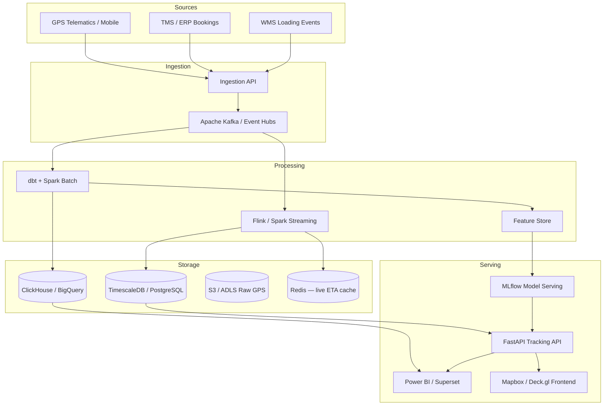

# Enterprise Logistics Analytics — System Architecture

## Overview

End-to-end platform for **real-time shipment tracking**, **delay detection**, **segmented supplier/route analytics**, and **ML-based ETA/risk scoring** at enterprise scale.



## Component Responsibilities

| Layer | Technology (recommended) | Role |
|-------|---------------------------|------|
| **Frontend** | React + TypeScript, Mapbox GL, TanStack Query | Executive & ops dashboards, live map |
| **API** | FastAPI, OAuth2/JWT, OpenAPI | Bookings, pings, ETA, alerts |
| **Stream** | Kafka + Flink | GPS normalization, geofence, delay rules |
| **Batch** | Airflow + dbt + Spark | KPI marts, supplier scorecards |
| **OLTP** | PostgreSQL + TimescaleDB | Shipments, pings, predictions |
| **OLAP** | ClickHouse or BigQuery | Route/material aggregates |
| **Cache** | Redis | Last position, ETA TTL |
| **ML** | MLflow, LightGBM, optional Feast | ETA, delay risk, anomalies |
| **Observability** | Prometheus, Grafana, OpenTelemetry | SLOs on ingest lag & API latency |

## Real-Time Tracking Engine

1. **Ingest** GPS ping → validate coords → dedupe by `(booking_id, ping_ts)`.
2. **Enrich** with active shipment context from Redis/Postgres.
3. **Compute** segment speed, idle (>2 km/h for >2h), geofence entry/exit.
4. **Detect delay** when `now + predicted_remaining > planned_eta`.
5. **Publish** WebSocket/SSE event to dashboard & notification service.

## Current Dataset Limitation

The uploaded Excel file contains **~1 GPS snapshot per booking**. Trajectory analytics (idle/moving split) require **30–60 second ping cadence** — architecture above supports that; notebook includes snapshot analysis + trajectory preprocessor stub.

## Folder Structure

```
Logistics/
├── Transportation & Logistics Tracking Dataset.xlsx
├── notebooks/logistics_analytics_tracking.ipynb
├── src/                    # Pipelines (load, clean, features, ML)
├── scripts/
├── sql/schema.sql
├── docs/
├── api/                    # (Phase 2) OpenAPI service
├── dbt/                    # (Phase 3) Analytics marts
├── infra/                  # (Phase 4) Terraform/K8s
└── tests/
```
