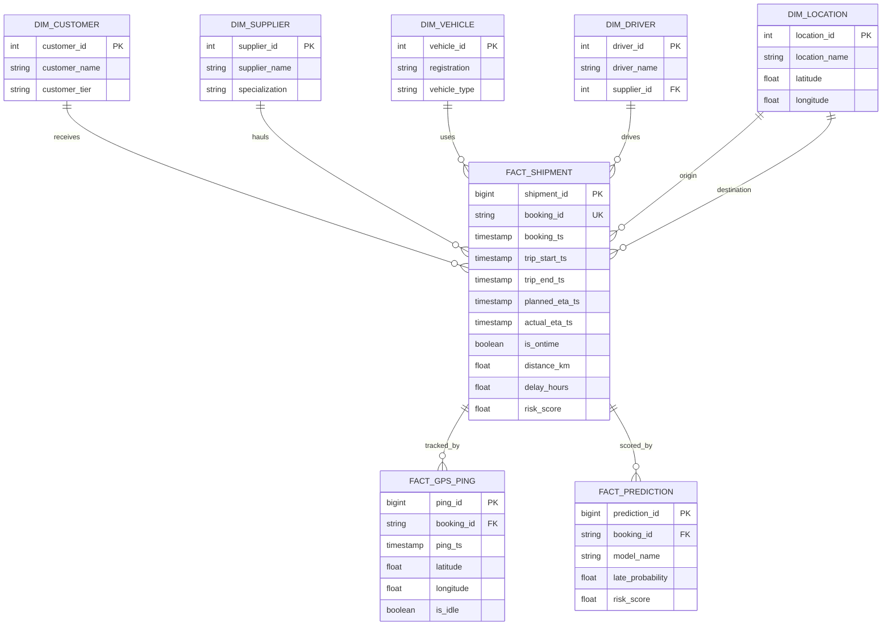

# Database ERD

```mermaid
erDiagram
    DIM_CUSTOMER ||--o{ FACT_SHIPMENT : receives
    DIM_SUPPLIER ||--o{ FACT_SHIPMENT : hauls
    DIM_VEHICLE ||--o{ FACT_SHIPMENT : uses
    DIM_DRIVER ||--o{ FACT_SHIPMENT : drives
    DIM_LOCATION ||--o{ FACT_SHIPMENT : origin
    DIM_LOCATION ||--o{ FACT_SHIPMENT : destination
    FACT_SHIPMENT ||--o{ FACT_GPS_PING : tracked_by
    FACT_SHIPMENT ||--o{ FACT_PREDICTION : scored_by

    DIM_CUSTOMER {
        int customer_id PK
        string customer_name
        string customer_tier
    }
    DIM_SUPPLIER {
        int supplier_id PK
        string supplier_name
        string specialization
    }
    DIM_VEHICLE {
        int vehicle_id PK
        string registration
        string vehicle_type
    }
    DIM_DRIVER {
        int driver_id PK
        string driver_name
        int supplier_id FK
    }
    DIM_LOCATION {
        int location_id PK
        string location_name
        float latitude
        float longitude
    }
    FACT_SHIPMENT {
        bigint shipment_id PK
        string booking_id UK
        timestamp booking_ts
        timestamp trip_start_ts
        timestamp trip_end_ts
        timestamp planned_eta_ts
        timestamp actual_eta_ts
        boolean is_ontime
        float distance_km
        float delay_hours
        float risk_score
    }
    FACT_GPS_PING {
        bigint ping_id PK
        string booking_id FK
        timestamp ping_ts
        float latitude
        float longitude
        boolean is_idle
    }
    FACT_PREDICTION {
        bigint prediction_id PK
        string booking_id FK
        string model_name
        float late_probability
        float risk_score
    }
```

See executable DDL: [`sql/schema.sql`](../sql/schema.sql).
